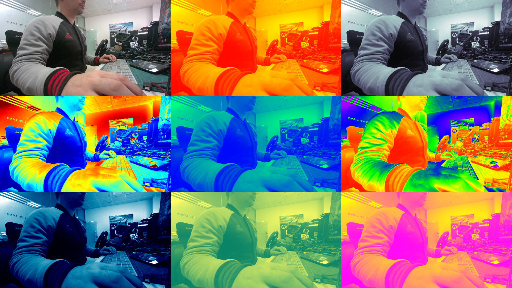
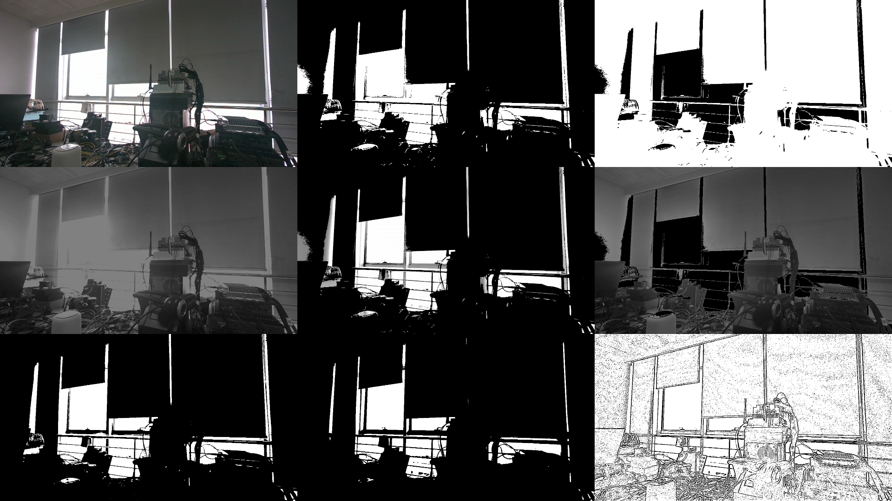
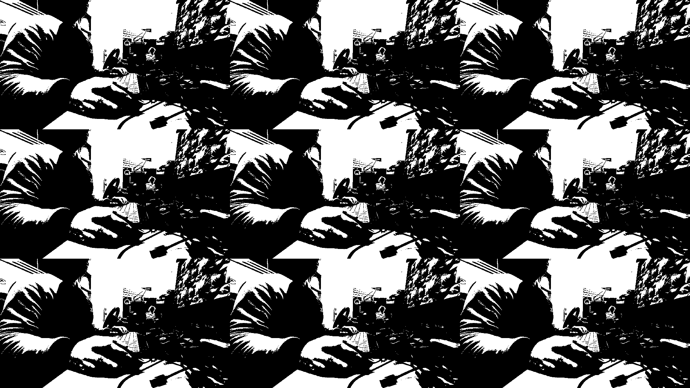
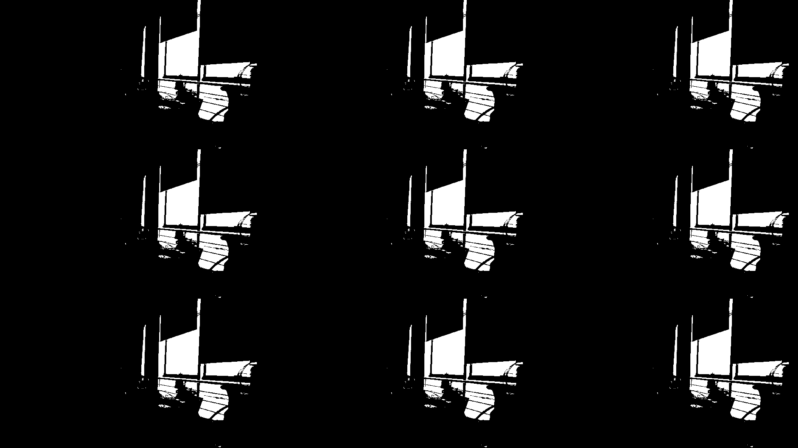
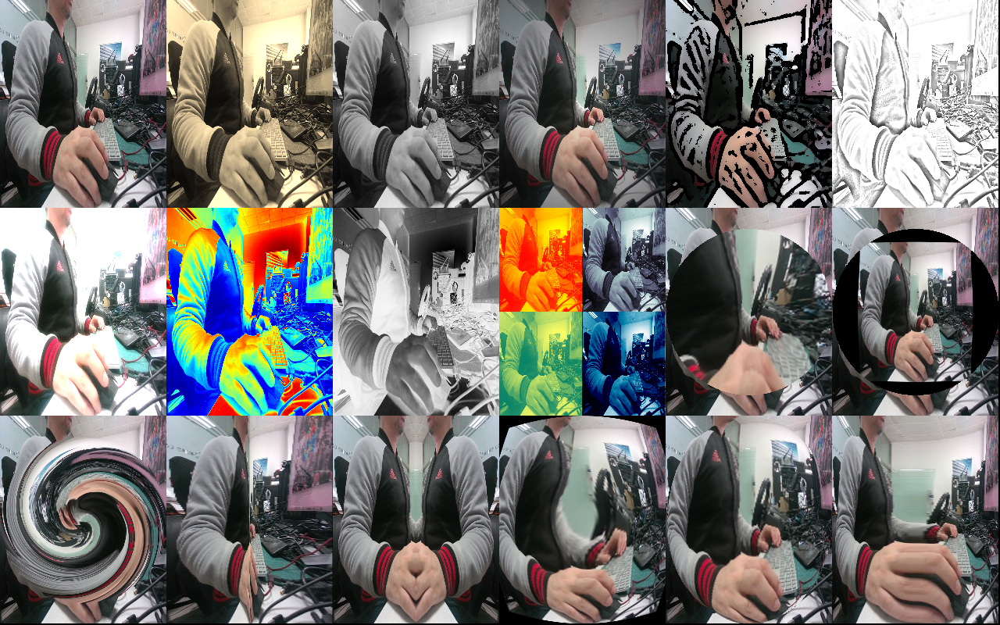

# Webcam Booth App

Webcam Booth App is a C++ application that provides real-time webcam video processing with various modes, including OpenCV-based image processing, CUDA-accelerated binary thresholding, and artistic photo booth effects.

[中文版 (Chinese Version)](#webcam-booth-app-中文版)

## Features

### 1. Colormap Mode (Default)
Displays a 3x3 grid showing the original frame and 8 different color map variations using OpenCV.

### 2. OpenCV Binary Mode
Displays a 3x3 grid demonstrating various OpenCV thresholding techniques (Binary, Binary Inverse, Truncate, ToZero, Otsu, Triangle, Adaptive).

### 3. CUDA Binary Mode
Utilizes CUDA for high-performance binary thresholding on the GPU, displaying a 3x3 grid of processed frames.

### 4. CUDA Triangle Threshold Mode
Demonstrates CUDA-accelerated Triangle thresholding algorithm in a 3x3 grid layout.

### 5. Photo Booth Mode
Offers a variety of artistic effects such as Sepia, Black & White, Comic Book, Distortion effects (Bulge, Twirl), and more.

## System Requirements

- **Operating System**: Windows 10 / 11
- **Hardware**:
  - Webcam
  - NVIDIA GPU (Required for CUDA modes)
- **Software Dependencies**:
  - CUDA Toolkit 11.8
  - OpenCV 4.8.0
  - Visual Studio (C++14 support)

## Controls

- **SPACE**: Switch to Normal (Colormap) Mode
- **B**: Toggle OpenCV Binary Mode
- **C**: Toggle CUDA Binary Mode
- **T**: Toggle CUDA Binary Threshold Triangle Mode
- **P**: Toggle Photo Booth Mode
  - **A**: Previous Effect
  - **D**: Next Effect
- **S**: Save Snapshot (PNG)
- **ESC**: Exit Application

## License and Author

- **Author**: Ke Yinejie
- **License**: MIT License

---

# Webcam Booth App (中文版)

Webcam Booth App 是一个基于 C++ 开发的实时摄像头图像处理应用，集成了 OpenCV 图像处理、CUDA 加速二值化以及多种趣味大头贴特效模式。

## 功能介绍

### 1. 色彩映射模式 (默认)
以 3x3 网格显示原始画面以及 8 种不同的 OpenCV 色彩映射 (ColorMap) 效果。

### 2. OpenCV 二值化模式
展示多种 OpenCV 阈值处理技术的效果对比（包括二值化、反转二值化、截断、取零、Otsu 大津法、三角法、自适应阈值等）。

### 3. CUDA 二值化模式
利用 CUDA 在 GPU 上进行高性能的二值化阈值处理，并以 3x3 网格显示。

### 4. CUDA 三角阈值模式
展示基于 CUDA 加速的三角阈值 (Triangle Threshold) 算法处理效果。

### 5. 大头贴特效模式
提供多种艺术滤镜和变形特效，如怀旧色、黑白、漫画风格、哈哈镜变形（膨胀、旋转）等。

## 系统要求

- **操作系统**: Windows 10 / 11
- **硬件**:
  - 摄像头
  - NVIDIA 显卡 (CUDA 模式需要)
- **软件依赖**:
  - CUDA Toolkit 11.8
  - OpenCV 4.8.0
  - Visual Studio (支持 C++14)

## 操作说明

- **SPACE (空格)**: 切换到普通 (色彩映射) 模式
- **B**: 切换 OpenCV 二值化模式
- **C**: 切换 CUDA 二值化模式
- **T**: 切换 CUDA 三角阈值模式
- **P**: 切换大头贴特效模式
  - **A**: 上一个特效
  - **D**: 下一个特效
- **S**: 保存截图 (PNG)
- **ESC**: 退出程序

## 版权与作者

- **作者**: Ke Yinejie
- **开源协议**: MIT License
